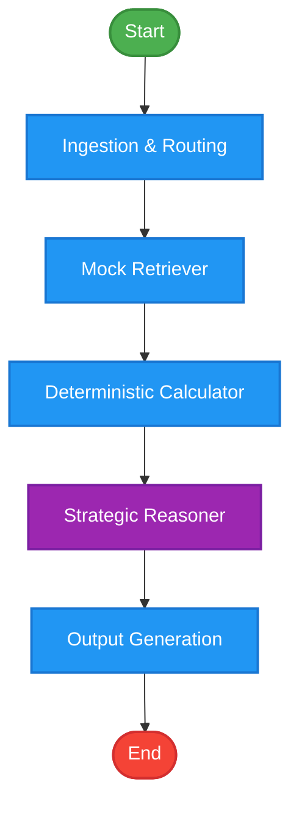

# Suproc Fair-Market Negotiator Agent

An intelligent B2B procurement negotiation agent built on LangGraph. This tool automatically ingests request-for-quote (RFQ) and supplier quote details, retrieves market cost data (materials, labor, and shipping), calculates estimated production costs and supplier profit margins, and leverages a Large Language Model (LLM) to perform strategic negotiation reasoning and draft cooperative supplier messages.

---

## Architecture & Workflow

The negotiator agent is implemented as a state machine using [LangGraph](https://github.com/langchain-ai/langgraph). The graph models the B2B negotiation flow through 5 distinct nodes:



### 1. Ingestion & Routing (`ingest_and_route`)
Extracts inputs from [rfq.json](file:///d:/Suproc/Task-NegotiatorAgent/Negotiator_Agent-Suproc/rfq.json) and [quote.json](file:///d:/Suproc/Task-NegotiatorAgent/Negotiator_Agent-Suproc/quote.json) and populates the unified state (`NegotiatorState`).

### 2. Mock Retriever (`mock_retriever`)
Queries [mock_market_db.json](file:///d:/Suproc/Task-NegotiatorAgent/Negotiator_Agent-Suproc/mock_market_db.json) to retrieve baseline market values:
- **Base Material Cost**: Estimated baseline cost for the requested item.
- **Labor Multiplier**: Adjusts manufacturing costs based on the supplier's location (e.g., Bengaluru, India has a `1.05` multiplier; Shenzhen, China has a `1.15` multiplier).
- **Shipping Cost per Unit**: Baseline transit cost for the route from the supplier's location to the buyer's destination.

### 3. Deterministic Calculator (`deterministic_calculator`)
Computes the true estimated baseline cost per unit, overall base cost, and the supplier's profit margin based on their quoted price:
$$\text{Base Cost Per Unit} = (\text{Material Cost} \times \text{Labor Multiplier}) + \text{Shipping Cost Per Unit}$$
$$\text{Total Base Cost} = \text{Base Cost Per Unit} \times \text{Quantity}$$
$$\text{Supplier Margin} = \frac{\text{Quoted Price} - \text{Total Base Cost}}{\text{Quoted Price}} \times 100$$

### 4. Strategic Reasoner (`strategic_reasoner`)
Sends the cost profile and calculated margin to the LangChain NVIDIA AI Endpoints (Nemotron-3-ultra model) via [llm_client.py](file:///d:/Suproc/Task-NegotiatorAgent/Negotiator_Agent-Suproc/llm_client.py).
- If the estimated supplier margin is **inflated (>30%)**, it drafts a collaborative, non-adversarial negotiation message proposing a fair-market target margin of **25%**.
- If the margin is **fair (20-30%)**, it drafts a standard acceptance message.

### 5. Output Generation (`output_generation`)
Parses the LLM's response into two distinct outputs:
- **Private Buyer Report**: An internal breakdown highlighting the estimated margin, true costs, and analysis for internal procurement alignment.
- **Drafted Message to Supplier**: A ready-to-send, relationship-focused proposal directed at the supplier.

---

## File Structure

- [main.py](file:///d:/Suproc/Task-NegotiatorAgent/Negotiator_Agent-Suproc/main.py): Command Line Interface (CLI) entry point. Handles parsing input files, invoking the LangGraph agent, and outputting reports.
- [negotiator_graph.py](file:///d:/Suproc/Task-NegotiatorAgent/Negotiator_Agent-Suproc/negotiator_graph.py): Defines the `NegotiatorState` and all graph node logic, and compiles the workflow.
- [llm_client.py](file:///d:/Suproc/Task-NegotiatorAgent/Negotiator_Agent-Suproc/llm_client.py): Initializes the LangChain client for NVIDIA's chat model.
- [mock_market_db.json](file:///d:/Suproc/Task-NegotiatorAgent/Negotiator_Agent-Suproc/mock_market_db.json): Database representing standard material costs, shipping routes, and manufacturing multipliers.
- [rfq.json](file:///d:/Suproc/Task-NegotiatorAgent/Negotiator_Agent-Suproc/rfq.json): Input file containing details of the item, quantity, and destination.
- [quote.json](file:///d:/Suproc/Task-NegotiatorAgent/Negotiator_Agent-Suproc/quote.json): Input file containing details of the supplier's location and proposed pricing.

---

## Getting Started

### Prerequisites

Ensure you have Python installed, then install the necessary dependencies:

```bash
pip install langgraph langchain-nvidia-ai-endpoints python-dotenv
```

Configure your environment variables by setting up your NVIDIA API Key. Create a `.env` file in the root directory:

```env
NVIDIA_API_KEY=your_nvidia_api_key_here
```

### Running the Agent

To execute the negotiation pipeline against the input files:

```bash
python main.py
```